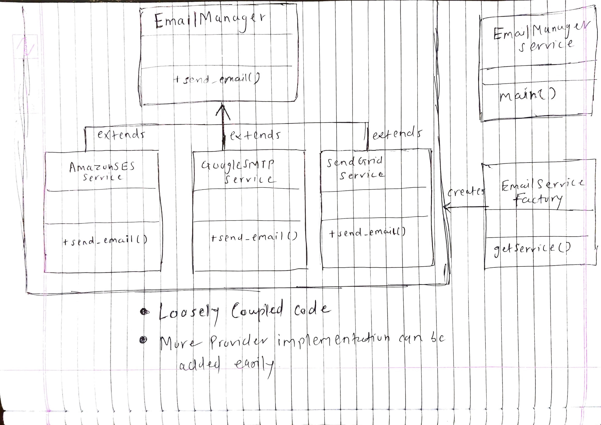

# yashi-multi-email-service-AUS

## Why did I chose this project out of 3 options

- **Excahange Rate** and **SF Movies** seems very small task to implement and to showcase the coding knowledge
- This project has something that I had never done before, which is developing and publishing own package. So I thought of chosing this, as it involves many things to implement and eventually I'll learn how to develop **pip packages**, **publish** and make it **open source**

## Description

- multi-email-service-yashpatel-AUS is python library which sends email via any of the service providers **Amazon SES**, **Google SMTP** or **SendGrid**
- Its is open source, currently publised to TestPyPI. https://test.pypi.org/project/multi-email-service-yashpatel-AUS/
- The package provides an abstraction between multiple email service providers, 
- If one of the services goes down, it can quickly failover to a another provider
- If no provider is passed, it will first try to send email from Amazon SES
- Pip package can be found here [multi-email-service-yashpatel-AUS](https://test.pypi.org/project/multi-email-service-yashpatel-AUS/)
- Can be installed using command

     ```pip3 install --index-url https://test.pypi.org/simple/ --extra-index-url https://pypi.org/simple multi-email-service-yashpatel-AUS==1.0.0```

## Things I would have improved or added if had more time

- functionality to attcach documents(pdf,images), support for cc, bcc etc in email

## Code Architectural.

- Here main focus was to make codebase loosely coupled
- I have used **factory method design pattern** so that code is extendable while adding implemntation for otehr providers in future and can be maintained easily

## UML Diagram



## link to django-email-service-AUS

- https://github.com/yashpatel7025/django-email-service-AUS/

### Contact for any difficulties accessing the webapp

- **Email**:- yashpatel7025@gmail.com
- **call**: 7021875166, **whatsapp**:9730039951
